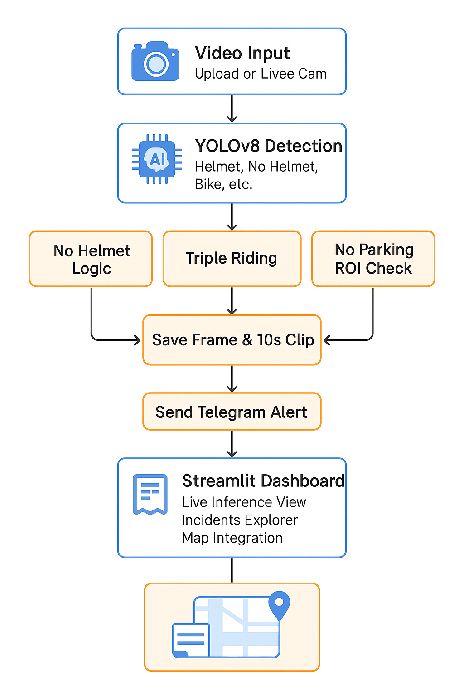
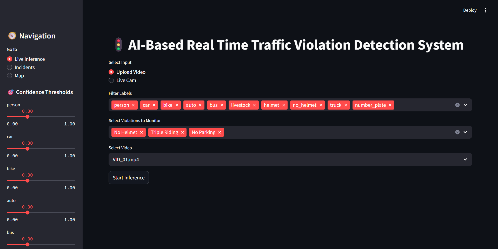
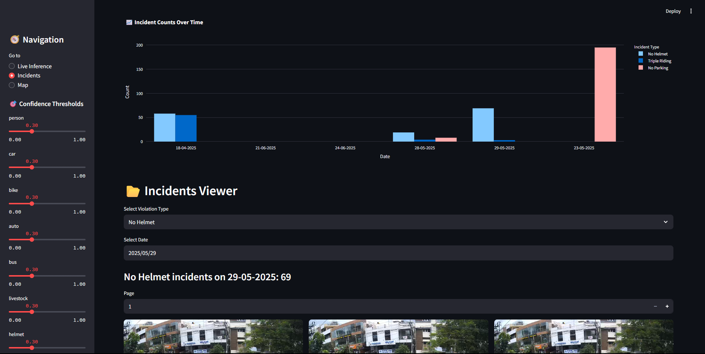

# 🚦 AI-Based Real-Time Traffic Violation Detection System

[](LICENSE)

---

## 📌 Project Overview

An end-to-end real-time traffic monitoring solution using YOLOv8 for object detection. The system detects traffic violations like **No Helmet**, **Triple Riding**, and **No Parking**, saves incident clips and frames, and provides a rich web interface for monitoring and analysis using Streamlit.

---

## ✨ Key Features

- 🎯 **Violation Types**: Detects
  - No Helmet
  - Triple Riding
  - No Parking (with polygonal ROI zone)
- 🎥 **Input Sources**: Works with uploaded videos or live IP camera streams.
- 🧠 **Object Detection**: YOLOv8-based object detection for high-speed inference.
- 🗃️ **Incident Logging**:
  - Saves annotated images and 10-second violation clips (5s before & after).
  - Stores incidents in date-wise folders.
- 🔔 **Alerts**: Sends violation images and messages to a configured **Telegram bot**.
- 📊 **Dashboard**:
  - Confidence threshold sliders.
  - Violation filtering options.
  - Calendar-based incident exploration.
  - Interactive graphs (Plotly) showing violation trends.
- 🗺️ **Map View**: Integrated Google Maps location viewer.

---

## 🧠 Model Details

- **Architecture**: YOLOv8 (Ultralytics)
- **Classes**: person, bike, helmet, no_helmet, car, auto, truck, bus, number_plate, livestock
- **Training Data**: Annotated via [CVAT](https://cvat.org/)
- **Export**: Supports conversion to ONNX / OpenVINO for edge deployment (optional)

---

## 🔁 System Flow

The following diagram illustrates the complete flow of the AI-based traffic violation detection system:



---

## 🧪 Folder Structure

```
inference/
├── models/
├── input_videos/
├── output_videos/output_videos_<date>/
├── incidents/
│   ├── no_helmet_<date>/frames, clips
│   ├── triple_riding_<date>/frames, clips
│   └── no_parking_<date>/frames, clips
```

---

## ⚙️ Technologies Used

- `Python 3.11`
- `Ultralytics YOLOv8`
- `OpenCV`
- `Torchvision`
- `Tesseract OCR`
- `Streamlit`
- `Plotly`
- `Telegram Bot API`

---

## 🧪 How It Works

1. **Streamlit Interface** to select:
   - Input type (Live camera or Uploaded video)
   - Which violations to monitor
2. **YOLOv8** handles detection.
3. **Violation Logic**:
   - No Helmet only if `no_helmet` is inside `person` inside `bike`
   - Triple Riding if 3+ persons inside one bike box
   - No Parking if stationary in defined polygonal zone for N seconds
4. **Clip Saving & Alerts**:
   - Saves 10s annotated clips
   - Sends alert image to Telegram bot
5. **Visualization Tab**:
   - Select date from calendar
   - See bar chart of violations by type
   - View individual incident images

---

## 🚀 Getting Started

```bash
pip install -r requirements.txt
streamlit run app.py
```

---
### 🖥️ Live Inference Tab



---

### 📂 Incidents Tab



---
## 📬 Contact

Developed by **Manoj R Gowda.**
Part of the **Digital Twin for Traffic Monitoring** initiative for demonstration to **BPRD**.

---

## 📜 License

This project is licensed under the MIT License.
